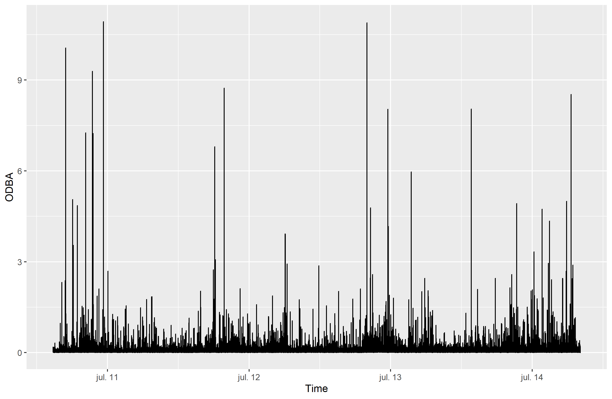
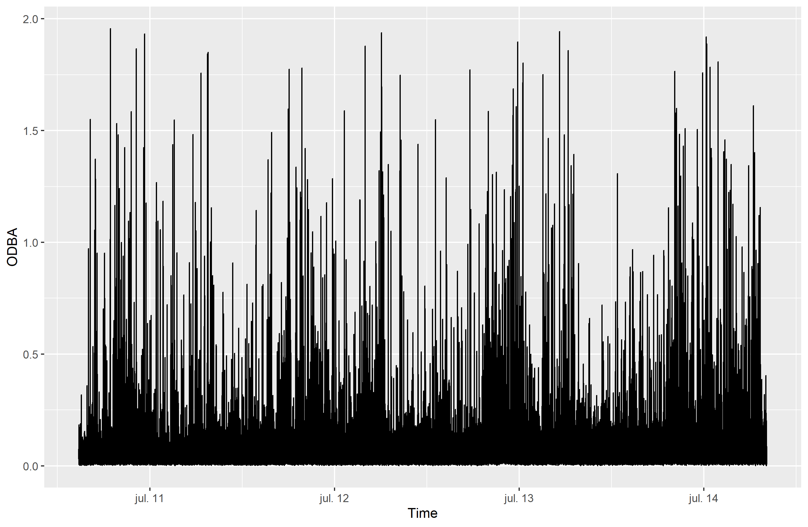
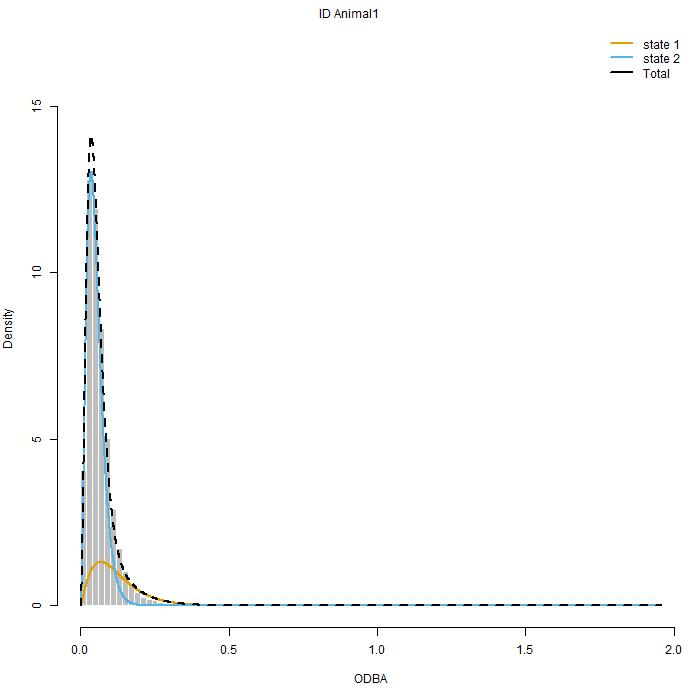

<!-- To be able to have continuous line numbers -->
```{=html}
<style>
body
  { counter-reset: source-line 0; }
pre.numberSource code
  { counter-reset: none; }
</style>
```

```{r setup, include=FALSE}
knitr::opts_chunk$set(echo = TRUE)
knitr::opts_chunk$set(warning = FALSE)
```


```{r,eval=F}
library(readr)
library(momentuHMM)
library(ggplot2)
library(dplyr)
library(lubridate)
```

```{r,echo=F,message=FALSE}

library(lubridate)
library(readr)
library(dplyr)
library(ggplot2)
library(momentuHMM)

```


# Accelerometer data (Blacktip shark data)

Accelerometer devices measure up to three axes, which can be described relative to the body of the animal: longitudinal (surge), lateral (sway) and dorsoventral (heave). In each case, means and variances of each of the three axes are used, as well as overall dynamic body acceleration (ODBA),
the sum of dynamic body acceleration from the three axes, among others.

ODBA is derived by smoothing over a time period, in this particular case, 1 s.

we applied HMMs to accelerometry data
obtained from a free-ranging blacktip reef shark Carcharhinus
melanopterus at Palmyra Atoll in the central Pacific Ocean
(data taken from Papastamatiou et al. 2015). A multisensor
package was attached to the dorsal fin of a 117-cm female
shark. The multisensor data-logger (ORI400-D3GT, Little
Leonardo, Tokyo, Japan) recorded three-dimensional acceler-
ation (at 20 Hz), depth and water temperature (at 1 Hz) and
was embedded in a foam float which detached from the shark
after 4 days (Papastamatiou et al. 2015). The package also
contained a VHF transmitter allowing recovery at the surface
after detachment.

```{r,eval=F}
# Let's read the data
BlacktipB <- read_delim("BlacktipB_original.txt", 
                        delim = "\t", escape_double = FALSE, 
                        trim_ws = TRUE)
# Now, it's time to transform the date/time info into a proper time format
# In this case we need to extract the second of the day correspondent to each observation 
# (range from 1 to 86400)
BlacktipB = BlacktipB %>% 
  mutate(Time = as.POSIXct(Time,format = "%m/%d/%Y %H:%M")) %>% 
  mutate(day = day(Time),hour_to_sec =  as.integer(seconds(hm(format(Time, format = "%H:%M")))))

```

```{r,echo=F}

BlacktipB = readRDS("BlacktipB_tidy.rds")

BlacktipB = BlacktipB %>% select(Time,Temp,Depth,ODBA,day,hour_to_sec)
head(BlacktipB)

```

Observing at the ODBA values through the observed period, we can observe that there are some values where ODBA has unusual values greater than 2 - usually this ranges between 0 and 2. As in article, we are going to filter certain values, since these are super messy

```{r,echo=F}



```


```{r}

BlacktipB = BlacktipB %>% filter(ODBA <= 2.0)

```

Much better. thus, we are ready to start to look for models for this data!

```{r,echo=F}



```


# Fitting our model

It's important to mention that there is some missing data (seconds at midnight were not measured), but since these are negligible, we will continue as expected.

active/inactive behaviour, since

Decisions. As mentioned in previous tutorials, now is time to implement the decisions that we have made so far. For the choose of initial parameter we can take a quick peak at the data (e.g., using the plots above). From the plots above, it looks like the animal has OBDA values at .1 and .3. As I see it, there are probably two behaviours with different OBDA around these values.


Now that the data is ready for modeling, we chose to fit a 2-stated hidden Markov model. For this purpose, we first need to assign the class `momentuHMMData` to the data in order to be presentable for the functiones related to `momentuHMM`.

```{r}

BlacktipBData = prepData(BlacktipB,coordNames = NULL,
                   covNames = "hour_to_sec")

```

Now, for choosing initial values for the distribution of ODBA, we take a look at the histogram of ODBA, which seems to have a peak in .1 and .3. So this will be the initial values for each of the state-dependent distributions. As well, since

Let's explore the results.

Akaike information criteria (AIC)

Think about mentioning something related to filtering values bigger than .4. This only helps see the histogram better, but it's important information that does not necessarily be making things more complicated.

```{r}

hist(BlacktipBData$ODBA[BlacktipBData$ODBA < .4],breaks=80)

```

```{r,eval=F}

fit1 = fitHMM(BlacktipBData,nbStates=2,dist=list(ODBA="gamma"),Par0 = list(ODBA=c(.1,.3,1,1)))

fit1
```

```{r,echo=F}

fit1 = readRDS("BlacktipB_m1.rds")
fit1

```

```{r,eval=F,echo=F}

fit1_10s = fitHMM(BlacktipBData,nbStates=2,dist=list(ODBA_mean_10s="gamma"),
                  Par0 = list(ODBA_mean_10s=c(.1,.3,1,1)))
fit1_10s

```

```{r,echo=F,eval=F}

fit1_10s = readRDS("BlacktipB_m1_10s.rds")
fit1_10s

```


```{r,eval=F,echo=F}

fit1_30s = fitHMM(BlacktipBData,nbStates=2,dist=list(ODBA_mean_30s="gamma"),
                  Par0 = list(ODBA_mean_30s=c(.1,.3,1,1)))
fit1_30s

```

```{r,eval=F,echo=F}

fit1_30s = readRDS("BlacktipB_m1_30s.rds")
fit1_30s

```


```{r,eval=F,echo=F}

fit1_60s = fitHMM(BlacktipBData,nbStates=2,dist=list(ODBA_mean_60s="gamma"),
                  Par0 = list(ODBA_mean_60s=c(.1,.3,1,1)))
fit1_60s


```

```{r,eval=F,echo=F}

fit1_60s = readRDS("BlacktipB_m1_60s.rds")
fit1_60s

```

```{r}

knitr::include_graphics("fit1_plot.png")

```

# Incorporating covariates

As in the article of Vianey, we can incorporate other information that may help explain the values of ODBA. In this case, we are considering the second of the day of every observation. Time of day is represented by two trigonometric functions with period 24 h, $cos(2\pi t/86,400)$ and $sin(2\pi t/86,400)$ (86 400 is the number of seconds in a day). Using the function cosinor, we can 
convert our data stream to something that is useful for us. As well, we need to provide the formula corresponding to the regression that will be stored in the transition probability values.

```{r,eval=F}
# formula corresponding to the regression coefficients for the transition probabilities
formula = ~ cosinor(hour_to_sec, period = 86400)
Par0_fit2 <- getPar0(model=fit1, formula=formula)

fit2 = fitHMM(BlacktipBData,nbStates=2,dist=list(ODBA="gamma"),Par0 = list(ODBA=c(.1,.3,1,1)))

fit2
```

```{r,echo=F}

fit2 = readRDS("BlacktipB_m2.rds")
fit2

```

```{r,eval=F,echo=F}

formula_10s = ~ cosinor(hour_to_sec_10s, period = 8640)
Par0_fit2_10s <- getPar0(model=fit1_10s, formula=formula_10s)


fit2_10s = fitHMM(BlacktipBData_10s,nbStates=2,dist=list(ODBA_mean_10s="gamma"),
                  Par0 = list(ODBA_mean_10s=c(.1,.3,1,1)))
fit2_10s

```

```{r,eval=F,echo=F}

fit2_10s = readRDS("BlacktipB_m2_10s.rds")
fit2_10s

```


```{r,eval=F,echo=F}

formula_30s = ~ cosinor(hour_to_sec_30s, period = 2880)
Par0_fit2_30s <- getPar0(model=fit1_30s, formula=formula_30s)

fit2_30s = fitHMM(BlacktipBData_30s,nbStates=2,dist=list(ODBA_mean_30s="gamma"),
                  Par0 = list(ODBA_mean_30s=c(.1,.3,1,1)))
fit2_30s

```

```{r,eval=F,echo=F}

fit2_30s = readRDS("BlacktipB_m2_30s.rds")
fit2_30s

```


```{r,eval=F,echo=F}

formula_60s = ~ cosinor(hour_to_sec_60s, period = 1440)
Par0_fit2_60s <- getPar0(model=fit1_60s, formula=formula_60s)

fit2_60s = fitHMM(BlacktipBData_60s,nbStates=2,dist=list(ODBA_mean_60s="gamma"),
                  Par0 = list(ODBA_mean_60s=c(.1,.3,1,1)))
fit2_60s


```

```{r,eval=F,echo=F}

fit2_60s = readRDS("BlacktipB_m2_60s.rds")
fit2_60s

```

```{r}



```

# Hierarchical Hidden Markov models

```{r}
# Read the data
tigerShark <- read_csv("tigershark_depthchange10min.csv")
head(tigerShark)

```


```{r}

tigerShark %>%
  filter(days != 9) %>% 
  ggplot(aes(x=HST,y=Depth)) + facet_wrap(~days,scales = "free_x") + geom_line() +
  scale_x_datetime(breaks= "8 hour", date_labels = "%H:%M") + theme_minimal()

tigerShark %>% mutate(change_depth = Depth - lag(Depth,default = 0)) %>%
  filter(days != 9) %>% 
  ggplot(aes(x=HST,y=2*abs(change_depth))) + facet_wrap(~days,scales = "free_x") + geom_line() +
  scale_x_datetime(breaks= "8 hour", date_labels = "%H:%M") + theme_minimal()


```

## Appendix

Before choosing anything in particular, we fitted different Hidden Markov models to different datasets, which varied in how the ODBA were considered (every 1-second, every 10 seconds, every 30 seconds, and 1 min). Looking at the ACF, we observed that, even if the model broke the conditionally dependencency assumption in the hidden process, the original dataset was still one of the best in terms of lowest autocorrelation. 

