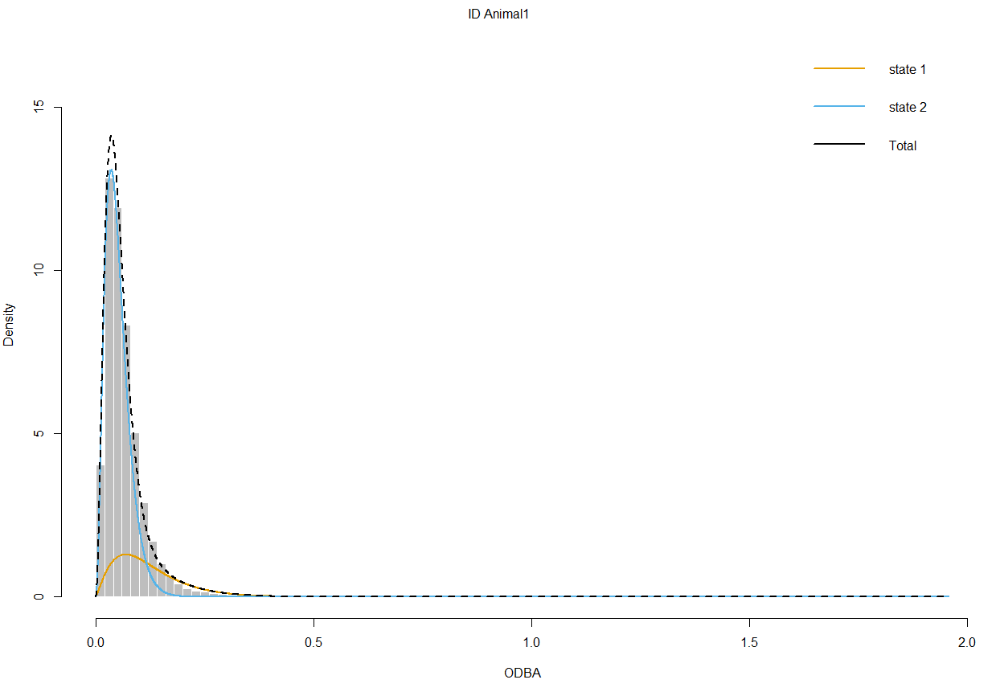

<!-- To be able to have continuous line numbers -->
```{=html}
<style>
body
  { counter-reset: source-line 0; }
pre.numberSource code
  { counter-reset: none; }
</style>
```

```{r setup, include=FALSE}
knitr::opts_chunk$set(echo = TRUE)
knitr::opts_chunk$set(warning = FALSE)
```


```{r,eval=F}
library(readr)
library(momentuHMM)
library(ggplot2)
library(dplyr)
library(lubridate)
library(data.tree)
```

```{r,echo=F,message=FALSE}

library(lubridate)
library(readr)
library(dplyr)
library(ggplot2)
library(momentuHMM)

```


# Tutorial objectives

The goal of this tutorial is to explore how to fit hidden Markov models to accelerometer data, the incorporation of covariates on the transition probabilities, and the implementation of hierarchical Markov models to Depth data. For the first two objectives, we will use 4 days of accelerometry data obtained from a free-ranging blacktip reef shark at Palmyra Atoll in the central Pacific Ocean (data taken from Papastamatiou et al. 2015). 

Mention something about hierarchical HMM and 


<!-- A multisensor package was attached to the dorsal fin of a 117-cm female shark. The multisensor data-logger (ORI400-D3GT, Little Leonardo, Tokyo, Japan) recorded three-dimensional acceleration (at 20 Hz), depth and water temperature (at 1 Hz) and was embedded in a foam float which detached from the shark after 4 days (Papastamatiou et al. 2015).  -->


# Accelerometer data

Accelerometer devices measure up to three axes, which can be described relative to the body of the animal: longitudinal (surge), lateral (sway) and dorsoventral (heave). In each case, means and variances of each of the three axes are used, as well as overall dynamic body acceleration (ODBA),
the sum of dynamic body acceleration from the three axes, among others. In the dataset that we'll be using, the ODBA of the shark was calculated every second.

The dataset contains information such as the time of the observation, the "water temperature", "depth" and ODBA. Since one of our goals is to use the time of observations (second of the day) as a covariate, we need to extract this information from the Time variable.

```{r,eval=F}
# Reading the data
BlacktipB <- read_delim("BlacktipB_original.txt", 
                        delim = "\t", escape_double = FALSE, 
                        trim_ws = TRUE)
# Let's transform the date/time info into a proper time format
# In this case we need to extract the second of the day correspondent to each observation 
BlacktipB = BlacktipB %>% 
  mutate(Time = as.POSIXct(Time,format = "%m/%d/%Y %H:%M")) %>% 
  mutate(hour_to_sec =  as.integer(seconds(hm(format(Time, format = "%H:%M")))))

```

```{r,echo=F}

BlacktipB = readRDS("BlacktipB_tidy.rds")

BlacktipB = BlacktipB %>% select(Time,Temp,Depth,ODBA,hour_to_sec)
head(BlacktipB)

```

Looking at the ODBA values through the observed period, we find ODBA is inusually high at some times - usually this measurement is ranging between 0 and 2. Since this could cause a problem at the moment of identifying behaviours, we will take them off from the dataset.

```{r,echo=F}

knitr::include_graphics("plots/timeSeriesODBA.png")

```


```{r}

BlacktipB = BlacktipB %>% filter(ODBA <= 2.0)

```

Much better. Now, we are ready to start to look for models for this data!

```{r,echo=F}


```


# Fitting our model

Given our data, we are interested in finding possible behaviours through the observation process (ODBA). Let's take a quick look at the histogram of the observations.

```{r, echo=F}

hist(BlacktipB$ODBA[BlacktipB$ODBA < .4],breaks=80,main="Histogram of ODBA", 
     xlab = "ODBA")

```


As we have indicated before, the best way to start when fitting a Hidden Markov model is to keep things simple. In this case, we will be considering 2 behavioral states, and no covariates for the transition probability matrix. 


For faciliting the search of the 2 state-dependent distributions, we need to provide some initial values so make easier the function to find such densities.

As mentioned in previous tutorials, now is time to implement the decisions that we have made so far. For the choose of initial parameter we can take a quick peak at the data (e.g., using the plots above). From the plots above, it looks like the animal has OBDA values at .1 and .3. As I see it, there are probably two behaviours with different OBDA around these values.

active/inactive behaviour, since


Now that the data is ready for modeling, we chose to fit a 2-stated hidden Markov model. For this purpose, we first need to assign the class `momentuHMMData` to the data in order to be presentable for the functiones related to `momentuHMM`.

```{r}

BlacktipBData = prepData(BlacktipB,coordNames = NULL,
                   covNames = "hour_to_sec")

```

Now, for choosing initial values for the distribution of ODBA, we take a look at the histogram of ODBA, which seems to have a peak in .1 and .3. So this will be the initial values for each of the state-dependent distributions. As well, since


Filtering observations to be lower than .4 (only a few are up to this value, and for the sake of a good visualization), we can observe that data concentrates around .1 and .3, so it seems these could be good initial values candidates for the distribution of the ODBA data.


```{r,eval=F}

fit1 = fitHMM(BlacktipBData,nbStates=2,dist=list(ODBA="gamma"),Par0 = list(ODBA=c(.1,.3,1,1)))

fit1
```

```{r,echo=F}

fit1 = readRDS("BlacktipB_m1.rds")
fit1

```

```{r,eval=F,echo=F}

fit1_10s = fitHMM(BlacktipBData,nbStates=2,dist=list(ODBA_mean_10s="gamma"),
                  Par0 = list(ODBA_mean_10s=c(.1,.3,1,1)))
fit1_10s

```

```{r,echo=F,eval=F}

fit1_10s = readRDS("BlacktipB_m1_10s.rds")
fit1_10s

```


```{r,eval=F,echo=F}

fit1_30s = fitHMM(BlacktipBData,nbStates=2,dist=list(ODBA_mean_30s="gamma"),
                  Par0 = list(ODBA_mean_30s=c(.1,.3,1,1)))
fit1_30s

```

```{r,eval=F,echo=F}

fit1_30s = readRDS("BlacktipB_m1_30s.rds")
fit1_30s

```


```{r,eval=F,echo=F}

fit1_60s = fitHMM(BlacktipBData,nbStates=2,dist=list(ODBA_mean_60s="gamma"),
                  Par0 = list(ODBA_mean_60s=c(.1,.3,1,1)))
fit1_60s


```

```{r,eval=F,echo=F}

fit1_60s = readRDS("BlacktipB_m1_60s.rds")
fit1_60s

```

```{r,eval=F}

plot(fit1,breaks = 80)

```

```{r,echo=F}

knitr::include_graphics("fit1_plot.png")

```

# Incorporating covariates

As in the article of Vianey, we can incorporate other information that may help explain the values of ODBA. In this case, we are considering the second of the day of every observation. Time of day is represented by two trigonometric functions with period 24 h, $cos(2\pi t/86,400)$ and $sin(2\pi t/86,400)$ (86 400 is the number of seconds in a day). Using the function cosinor, we can 
convert our data stream to something that is useful for us. As well, we need to provide the formula corresponding to the regression that will be stored in the transition probability values.

```{r,eval=F}
# formula corresponding to the regression coefficients for the transition probabilities
formula = ~ cosinor(hour_to_sec, period = 86400)
Par0_fit2 <- getPar0(model=fit1, formula=formula)

fit2 = fitHMM(BlacktipBData,nbStates=2,dist=list(ODBA="gamma"),Par0 = list(ODBA=c(.1,.3,1,1)))

fit2
```

```{r,echo=F}

fit2 = readRDS("BlacktipB_m2.rds")
fit2

```

```{r,eval=F,echo=F}

formula_10s = ~ cosinor(hour_to_sec_10s, period = 8640)
Par0_fit2_10s <- getPar0(model=fit1_10s, formula=formula_10s)


fit2_10s = fitHMM(BlacktipBData_10s,nbStates=2,dist=list(ODBA_mean_10s="gamma"),
                  Par0 = list(ODBA_mean_10s=c(.1,.3,1,1)))
fit2_10s

```

```{r,eval=F,echo=F}

fit2_10s = readRDS("BlacktipB_m2_10s.rds")
fit2_10s

```


```{r,eval=F,echo=F}

formula_30s = ~ cosinor(hour_to_sec_30s, period = 2880)
Par0_fit2_30s <- getPar0(model=fit1_30s, formula=formula_30s)

fit2_30s = fitHMM(BlacktipBData_30s,nbStates=2,dist=list(ODBA_mean_30s="gamma"),
                  Par0 = list(ODBA_mean_30s=c(.1,.3,1,1)))
fit2_30s

```

```{r,eval=F,echo=F}

fit2_30s = readRDS("BlacktipB_m2_30s.rds")
fit2_30s

```


```{r,eval=F,echo=F}

formula_60s = ~ cosinor(hour_to_sec_60s, period = 1440)
Par0_fit2_60s <- getPar0(model=fit1_60s, formula=formula_60s)

fit2_60s = fitHMM(BlacktipBData_60s,nbStates=2,dist=list(ODBA_mean_60s="gamma"),
                  Par0 = list(ODBA_mean_60s=c(.1,.3,1,1)))
fit2_60s


```

```{r,eval=F,echo=F}

fit2_60s = readRDS("BlacktipB_m2_60s.rds")
fit2_60s

```

```{r,eval=F}

plot(fit2)

```

```{r,echo=F}



```


Let's explore the results.

Akaike information criteria (AIC)


# Hierarchical Hidden Markov models

```{r}

# Read the data
tigerShark <- read_csv("tigershark_depthchange10min.csv")
tigerShark = tigerShark %>% mutate(abs_change_depth = abs(Depth - lag(Depth,default = 0)))
head(tigerShark)

```


```{r}

tigerShark %>%
  filter(days != 9) %>%
  ggplot(aes(x=HST,y=Depth)) + facet_wrap(~days,scales = "free_x") + geom_line() +
  scale_x_datetime(breaks= "8 hour", date_labels = "%H:%M") + theme_minimal()


tigerShark %>% filter(days != 9) %>% 
  ggplot(aes(x=HST,y=2*abs_change_depth)) + facet_wrap(~days,scales = "free_x") + geom_line() +
  scale_x_datetime(breaks= "8 hour", date_labels = "%H:%M") + theme_minimal()

```


```{r}

days_range = unique(tigerShark$days)
tigerSharkData <- NULL

for(i in days_range){
  coarseInd <- data.frame(tigerShark %>% filter(days == i) %>% 
                                   filter(row_number() == 1) %>% select(HST),
                                 days = i,
                                 level=c("1","2i"),
                                 abs_change_depth=NA)
  tmp <- rbind(coarseInd,tigerShark %>% filter(days == i) %>% mutate(level = "2") %>% 
                 select(HST,days,level,abs_change_depth))
  tigerSharkData <- rbind(tigerSharkData,tmp)
}

head(tigerSharkData)

tigerSharkData = prepData(tigerSharkData,
                          coordNames = NULL, hierLevels = c("1","2i","2"))


# summarize prepared data
summary(tigerSharkData, dataNames = names(tigerSharkData)[-1])

```

```{r}

### define hierarchical HMM
### states 1-3 = coarse state 1 (nonforaging)
### states 4-6 = coarse state 2 (foraging)
hierStates <- data.tree::Node$new("tiger shark HHMM states")
hierStates$AddChild(name="nontravelling")
hierStates$nontravelling$AddChild(name="nt1", state=1)
hierStates$nontravelling$AddChild(name="nt2", state=2)
hierStates$nontravelling$AddChild(name="nt3", state=3)
hierStates$AddChild(name="travelling")
hierStates$travelling$AddChild(name="t1", state=4)
hierStates$travelling$AddChild(name="t2", state=5)
hierStates$travelling$AddChild(name="t3", state=6)

plot(hierStates)

```

```{r,eval=F}

#Alternative way for specifying
hierStates <- data.tree::as.Node(list(name="tiger shark HHMM states",
                                      nontravelling=list(nt1=list(state=1),
                                                nt2=list(state=2),
                                                nt3=list(state=3)),
                                      travelling=list(t1=list(state=4),
                                                    t2=list(state=5),
                                                    t3=list(state=6))))

```


The name for any of the “children” added to a node are user-specified and are akin
to the stateNames argument in fitHMM for a standard HMM. While these names are
arbitrary, the name and state attributes must be unique.

```{r}

# data stream distributions
# level 1 = coarse scale (no data streams)
# level 2 = fine scale (dive_duration, maximum_depth, dive_wiggliness)
hierDist <- data.tree::Node$new("tiger shark HHMM dist")
hierDist$AddChild(name="level1")
hierDist$AddChild(name="level2")
hierDist$level2$AddChild(name="abs_change_depth", dist="gamma")
plot(hierDist)

```


The Node attribute dist is required in hierDist and specifies the probability dis-
tribution for each data stream at each level of the hierarchy (Figure 14. In this case,
level1 (corresponding to coarse-scale observations with level=1) has no data streams,
and each of the data streams for level2 (corresponding to fine-scale observations with
level=2) is assigned a gamma distribution. Include more information related to this from momentuHMM documentation (page 93).


[...] did not include any covariates on the t.p.m. or initial
distribution for either level of the hierarchy, but, for demonstration purposes, here is
how we would use the hierFormula and hierFormulaDelta arguments to specify the
t.p.m. and initial distribution formula for each level of the hierarchy in fitHMM:

```{r}

# define hierarchical t.p.m. formula(s)
hierFormula <- data.tree::Node$new("harbor porpoise HHMM formula")
hierFormula$AddChild(name="level1", formula=~1)
hierFormula$AddChild(name="level2", formula=~1)

# define hierarchical initial distribution formula(s)
hierFormulaDelta <- data.tree::Node$new("harbor porpoise HHMM formulaDelta")
hierFormulaDelta$AddChild(name="level1", formulaDelta=~1)
hierFormulaDelta$AddChild(name="level2", formulaDelta=~1)

```

assume the data stream probability distributions do not
depend on the coarse-scale state, so we can constrain the state-dependent parameters
for states 1 (“nf1”) and 4 (“f1”), states 2 (“nf2”) and 5 (“f2”), and states 3 (“nf3”) and
6 (“f3”) to be equal using the DM argument:

```{r}

# defining starting values
cd.mu0 = rep(c(5,50,100),hierStates$count)
cd.sigma0 = rep(c(5,15,40),hierStates$count)
cd.pi0 = rep(c(0.2,0.01,0.01),hierStates$count)

Par0 = list(abs_change_depth = c(cd.mu0,cd.sigma0,cd.pi0))

nbStates <- length(hierStates$Get("state",filterFun=data.tree::isLeaf))


```

```{r}

# constrain fine-scale data stream distributions to be same
cd_DM <- matrix(cbind(kronecker(c(1,1,0,0,0,0),diag(3)),
                      kronecker(c(0,0,1,1,0,0),diag(3)),
                      kronecker(c(0,0,0,0,1,1),diag(3))),
                nrow=nbStates*3,
                ncol=9,
                dimnames=list(c(paste0("mean_",1:nbStates),
                                paste0("sd_",1:nbStates),
                                paste0("zeromass_",1:nbStates)),
                              paste0(rep(c("mean","sd","zeromass"),each=3),
                                     c("_14:(Intercept)",
                                       "_25:(Intercept)",
                                       "_36:(Intercept)"))))
DM = list(abs_change_depth = cd_DM)

```

```{r}

# get initial parameter values for data stream probability distributions
Par <- getParDM(tigerSharkData,hierStates=hierStates,hierDist=hierDist,
                Par=Par0,DM=DM)

# check hierarchical model specification and parameters
checkPar0(tigerSharkData,hierStates=hierStates,hierDist=hierDist,Par0=Par,
          hierFormula=hierFormula,hierFormulaDelta=hierFormulaDelta,
          DM=DM)

```

```{r,eval=F}

# fit hierarchical HMM
hhmm <- fitHMM(data=tigerSharkData,hierStates=hierStates,hierDist=hierDist,
               #hierFormula=hierFormula,#hierFormulaDelta=hierFormulaDelta,
               Par0=Par,#hierBeta=hierBeta,hierDelta=hierDelta,
               DM=DM,nlmPar=list(hessian=FALSE))
hhmm

```

```{r,echo=F}

hhmm = readRDS("hmm.rds")
hhmm

```

## Appendix

Before choosing anything in particular, we fitted different Hidden Markov models to different datasets, which varied in how the ODBA were considered (every 1-second, every 10 seconds, every 30 seconds, and 1 min). Looking at the ACF, we observed that, even if the model broke the conditionally dependencency assumption in the hidden process, the original dataset was still one of the best in terms of lowest autocorrelation. 


# To include

-comparison of different initial values for the distribution of ODBA for basic HMM (log-likelihood and estimated coefficients)

-comparison of --- basic HMM with covariates (----)

-create content for hierarchical HMM and explanation of other things


-include the most likely pattern for the sharks (basic HMM)